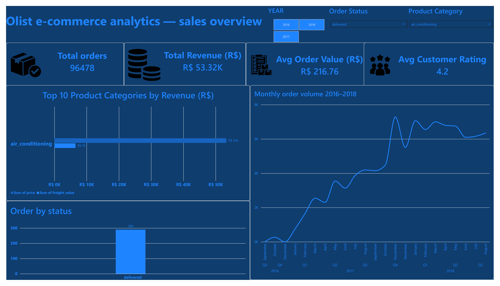
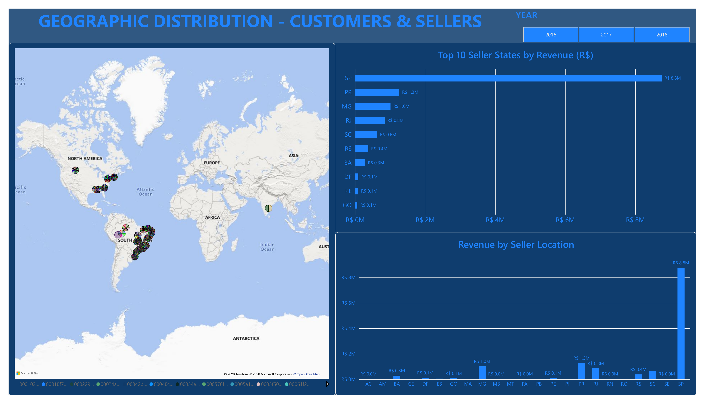
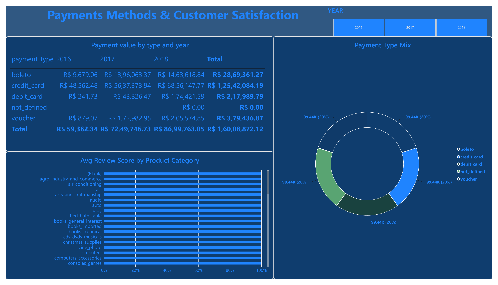

# Olist E-Commerce Analytics — Power BI Dashboard (PR3)

A 3-page Power BI dashboard analyzing the Brazilian Olist e-commerce dataset — built as Practical Report 3 for Red & White Skill Education's Power BI course. The project models 9 raw CSV files into a Star/Galaxy schema, builds a custom date dimension, and delivers Sales, Geographic, and Payments & Reviews reporting pages with full drill-down and cross-filtering.

---

## 📊 Dataset

- **Name:** Brazilian E-Commerce Public Dataset by Olist
- **Author:** Olist (olistbr) on Kaggle
- **Source:** [kaggle.com/datasets/olistbr/brazilian-ecommerce](https://www.kaggle.com/datasets/olistbr/brazilian-ecommerce)
- **Scope:** 9 CSV files, 54 columns total, connected by primary/foreign keys — real anonymized commercial data (customer names replaced, IDs are UUID-format hashes)

| Source File | Role | Approx. Rows |
|---|---|---|
| olist_order_items_dataset.csv | Fact Table | 112,650 |
| olist_orders_dataset.csv | Dimension | 99,441 |
| olist_customers_dataset.csv | Dimension | 99,441 |
| olist_products_dataset.csv | Dimension | 32,951 |
| olist_sellers_dataset.csv | Dimension | 3,095 |
| olist_order_payments_dataset.csv | Fact Table | 103,886 |
| olist_order_reviews_dataset.csv | Fact Table | 99,224 |
| olist_geolocation_dataset.csv | Geo Lookup | 1,000,163 |
| product_category_name_translation.csv | Category Lookup | 71 (merged into DimProducts) |

---

## 🗂️ Data Model — Star / Galaxy Schema

`FactOrderItems` sits at the centre as the primary Fact table (one row per item sold), with a custom `DimDate` calendar table built via Power Query M code to support time intelligence. `FactPayments` and `FactReviews` are secondary fact tables that share `DimOrders` as their connecting dimension — three fact tables around one shared dimension is a **Galaxy Schema (Fact Constellation)**. `DimOrders → DimCustomers` is a one-level **snowflake** extension, since customer records are stored independently of orders.

**Relationships (7 active + 1 inactive):**

| # | From | To | Cardinality | Cross-filter | Active |
|---|---|---|---|---|---|
| 1 | FactOrderItems[order_id] | DimOrders[order_id] | Many → One | Single | ✅ Yes |
| 2 | FactOrderItems[product_id] | DimProducts[product_id] | Many → One | Single | ✅ Yes |
| 3 | FactOrderItems[seller_id] | DimSellers[seller_id] | Many → One | Single | ✅ Yes |
| 4 | DimOrders[customer_id] | DimCustomers[customer_id] | Many → One | Single | ✅ Yes |
| 5 | DimDate[Date] | DimOrders[order_purchase_timestamp] | One → Many | Single | ✅ Yes (primary) |
| 6 | FactPayments[order_id] | DimOrders[order_id] | Many → One | Single | ✅ Yes |
| 7 | FactReviews[order_id] | DimOrders[order_id] | Many → One | Single | ✅ Yes |
| 8 | DimDate[Date] | DimOrders[order_delivered_customer_date] | One → Many | Single | ⛔ Inactive |

Fact tables never connect directly to one another — all filtering flows Dimension → Fact through `DimOrders`, avoiding ambiguous filter paths. Comparing `Avg Review Score by Product Category` (Page 3) required a DAX bridge (`TREATAS`) between `FactOrderItems` and `FactReviews`, since a Single-direction star schema has no native filter path between two fact tables that only share a common dimension.

**Star schema diagram:**

> _(Insert your hand-drawn/screenshotted Model View diagram here — e.g. `screenshots/model_view_star_schema.png`)_

---

## 🖥️ Report Pages

### Page 1 — Sales Overview
4 KPI cards (Total Orders, Total Revenue, Avg Order Value, Avg Customer Rating), Top 10 Product Categories by Revenue, Monthly Order Volume with Year → Quarter → Month drill-down, and an Orders by Status breakdown. Filterable by Year, Order Status, and Product Category slicers.



### Page 2 — Geographic Analysis
World/Brazil map of order distribution by customer state, Top 10 Seller States by Revenue, and Revenue by Seller Location with state → city drill-down.



### Page 3 — Payments & Reviews
Payment Value by Type and Year matrix (with % of total and conditional data bars), Payment Type Mix donut chart, and Avg Review Score by Product Category — computed via a `TREATAS`-based DAX measure bridging the two independent fact tables.



> Note: the screenshots above were captured with the Order Status / Product Category slicers engaged for demo purposes, so visible KPI figures reflect that filtered selection rather than the full unfiltered dataset.

---

## 🧮 Key DAX Measures

```DAX
Total Orders = DISTINCTCOUNT(DimOrders[order_id])

Total Revenue = SUM(FactOrderItems[price])

Avg Order Value =
AVERAGEX(
    DimOrders,
    CALCULATE(SUM(FactOrderItems[price]))
)

Avg Customer Rating = AVERAGE(FactReviews[review_score])

Avg Review Score by Category =
VAR RelevantOrders = VALUES(FactOrderItems[order_id])
RETURN
CALCULATE(
    AVERAGE(FactReviews[review_score]),
    TREATAS(RelevantOrders, FactReviews[order_id])
)
```

---

## 🛠️ Tools Used

- **Power BI Desktop** — data modeling, DAX, report design
- **Power Query (M)** — CSV ingestion, category merge, custom DimDate calendar table
- **Kaggle** — dataset source

---

## 🎥 Video Walkthrough

> _(Paste your unlisted YouTube or shared Google Drive video link here — face + screen, 5–10 min, covering Model View and all 3 report pages)_

---

## 📁 Repository Contents

```
├── README.md
├── brazilian_ecommerce_dashboard.pbix
├── /data                     ← 9 source CSVs (or link to Kaggle if size-limited)
└── /screenshots
    ├── page1_sales_overview.png
    ├── page2_geographic_analysis.png
    ├── page3_payments_reviews.png
    └── model_view_star_schema.png   ← add your Model View screenshot here
```

---

*Red & White Skill Education — Power BI Practical Report 3*
