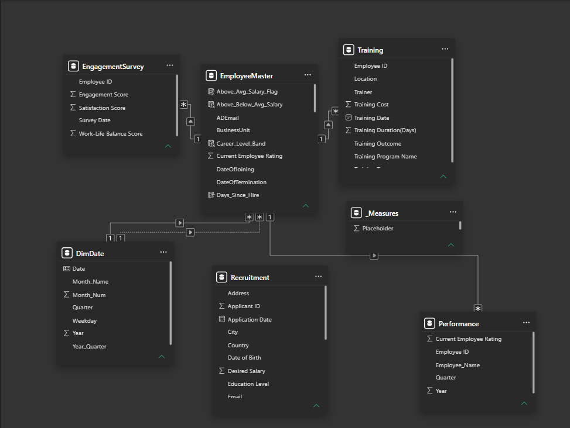
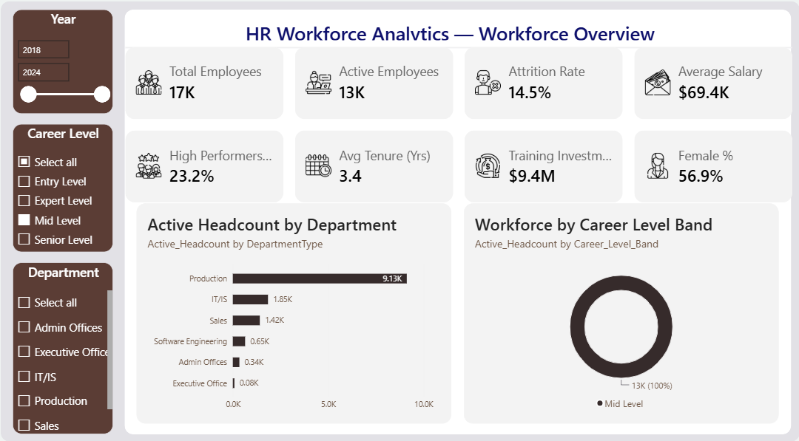
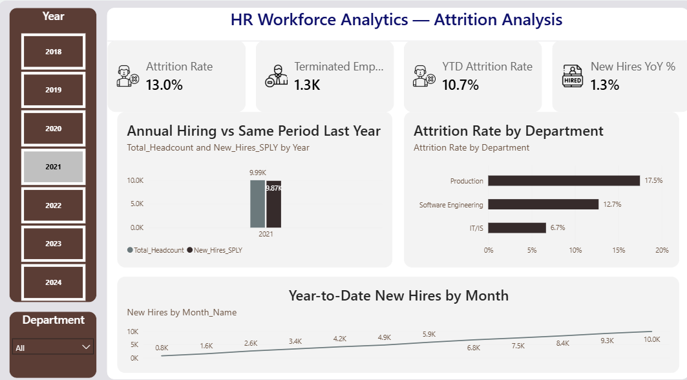
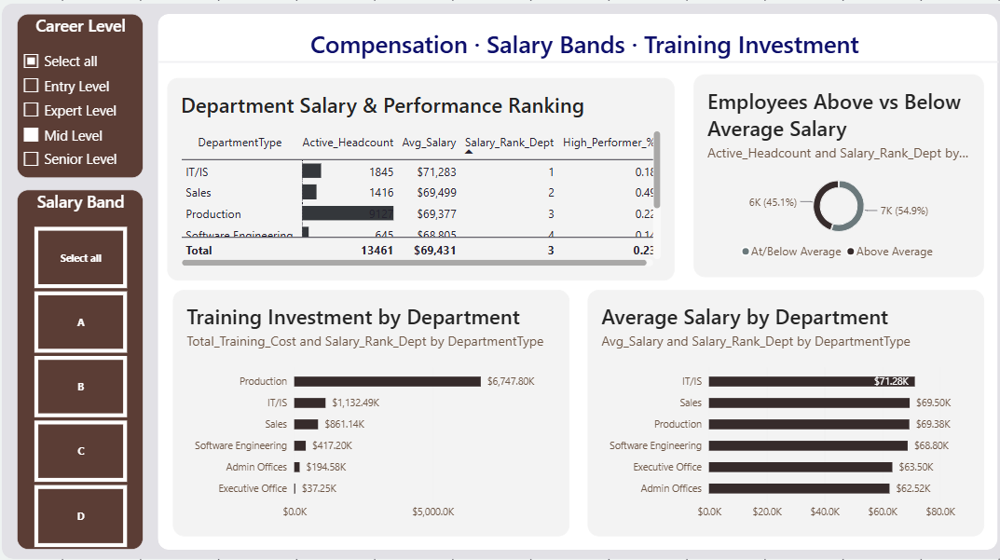

<div align="center">

# 👥 HR Workforce Analytics — Power BI Dashboard

### End-to-End HR Analytics | Star Schema Data Model | 25+ Advanced DAX Measures | Time Intelligence

[](https://powerbi.microsoft.com/)
[](#-dax-measure-documentation)
[](#-data-model)
[](#-dataset)
[](#-submission-checklist)

**Practical Report 4 (PR 4) · Power BI Course · Red & White Skill Education**

[Overview](#-project-overview) •
[Dataset](#-dataset) •
[Data Model](#-data-model) •
[Dashboard](#-dashboard-preview) •
[DAX Measures](#-dax-measure-documentation) •
[Insights](#-key-insights) •
[Tools](#-tools--technologies) •
[Video](#-video-walkthrough) •
[Structure](#-repository-structure)

</div>

---

## 📌 Project Overview

This project is an **end-to-end HR Workforce Analytics dashboard** built in Power BI Desktop, simulating a real-world People Analytics function. It answers the questions an HR/People leadership team actually asks:

- How large is our workforce, and how has it grown?
- What is our attrition rate — overall, year-to-date, and by department?
- Are we paying employees fairly relative to department benchmarks?
- How is training investment distributed, and does it correlate with performance?
- What does our career-level and gender-diversity mix look like?

The report is built on a **5-table relational data model** (later extended to 6 with a custom `DimDate` table), uses **row context vs. filter context** deliberately across calculated columns and measures, and layers in full **Time Intelligence** (YTD, SPLY, YoY %, DATEADD) using an active/inactive relationship pair with `USERELATIONSHIP`.

> 🎯 **Goal:** Demonstrate mastery of Power Query transformations, star-schema modeling, row vs. filter context, `CALCULATE`/`ALL`/`ALLEXCEPT`, iterator functions (`SUMX`/`AVERAGEX`), `RANKX`, and DAX Time Intelligence — not just build pretty charts.

---

## 📊 Dataset

**Source:** [Employee / HR Dataset All in One](https://www.kaggle.com/) — published on Kaggle by *Ravindra Singh Rana*
**License:** Open Data Commons — free to use for education and research

The dataset ships as **5 separate CSV files**. Four are linked by `Employee ID`; the fifth (`Recruitment`) is intentionally standalone, tracking applicants who are *not yet* employees.

| # | File | Renamed To | Key Columns | Role |
|---|------|-----------|-------------|------|
| 1 | `employee_data.csv` | **EmployeeMaster** | Employee ID, Salary, Names, GenderCode, DateOfJoining, DateOfTermination, EmployeeStatus, DepartmentType, Performance Score, Current Employee Rating | Fact / core dimension table |
| 2 | `training_and_development_data.csv` | **Training** | Employee ID, Training Date, Program Name, Training Type, Outcome, Duration, Training Cost | Fact table |
| 3 | `employee_engagement_survey_data.csv` | **EngagementSurvey** | Employee ID, Survey Date, Engagement / Satisfaction / Work-Life Balance Scores | Fact table |
| 4 | `performance_data.csv` | **Performance** | Employee ID, Year, Quarter, Employee_Name, Current Employee Rating | Fact table |
| 5 | `recruitment_data.csv` | **Recruitment** | Applicant ID, Application Date, Education, Experience, Desired Salary, Status | **Standalone** — no Employee ID, no relationship |

**Scale:** 50,000+ rows across all 5 files · **Time span:** `DateOfJoining` / `DateOfTermination` 2018–2023 · `Performance.Year` spans 2022–2026 (deliberately *not* linked to `DimDate` — treated as an independent Employee ID lookup rather than a time-intelligence source).

---

## 🧩 Data Model

A custom **`DimDate`** table was generated in Power Query (Blank Query → Advanced Editor, `List.Dates()`) and marked as an official **Date Table**, enabling every DAX Time Intelligence function used downstream.

```
                         ┌──────────────────┐
                         │      DimDate      │  (Date, Year, Quarter, Month_Num,
                         │  (Date Table ✔)   │   Month_Name, Weekday, Year_Quarter)
                         └─────────┬─────────┘
                    active ────────┤├──────── inactive
              DateOfJoining        │        DateOfTermination
                                   ▼
                         ┌──────────────────┐
                         │  EmployeeMaster   │◄──────────────┐
                         │   (core table)    │                │
                         └─────────┬─────────┘                │
              Employee ID  ┌───────┼───────┐          Employee ID
                          ▼        ▼        ▼
                    ┌─────────┐┌─────────┐┌─────────────┐
                    │ Training ││Engagement││ Performance │
                    │          ││ Survey   ││             │
                    └─────────┘└─────────┘└─────────────┘

                    ┌─────────────┐
                    │ Recruitment │   ← standalone (no Employee ID column,
                    │             │      applicants ≠ employees yet)
                    └─────────────┘
```

**Relationships (4 total):**
| From | To | Cardinality | Status |
|---|---|---|---|
| `EmployeeMaster[Employee ID]` | `Training[Employee ID]` | 1 : Many | Active |
| `EmployeeMaster[Employee ID]` | `EngagementSurvey[Employee ID]` | 1 : Many | Active |
| `EmployeeMaster[Employee ID]` | `Performance[Employee ID]` | 1 : Many | Active |
| `DimDate[Date]` | `EmployeeMaster[DateOfJoining]` | 1 : Many | **Active** |
| `DimDate[Date]` | `EmployeeMaster[DateOfTermination]` | 1 : Many | **Inactive** (switched in via `USERELATIONSHIP`) |

A dedicated, table-less **`_Measures`** table (created via *Enter Data*) houses all 25+ DAX measures for a clean, organized Fields pane.

**Model View — all 6 tables & relationships:**



---

## 🖥️ Dashboard Preview

The report ships as a **3-page executive dashboard**, styled with a consistent charcoal/red HR theme, KPI cards, and interactive slicers on every page.

### Page 1 — Workforce Overview
KPI cards for headcount, attrition, salary, and training, plus active headcount by department and career-level mix.



### Page 2 — Attrition Analysis
YoY hiring comparison, YTD hiring trend by month, and attrition rate broken down by department.



### Page 3 — Compensation
Department salary & performance ranking, above/below-average salary split, training investment, and average salary by department.



**Interactivity across all pages:**
- 🗓️ **Year** slicer (tile) — drives every Time Intelligence measure
- 🏢 **Department** slicer (dropdown) — live demonstration of filter context
- 🎖️ **Career Level Band** slicer (tile, calculated column) — Entry / Mid / Expert / Senior
- 💰 **Salary Band** slicer (Page 3) — A–D compensation quartiles

---

## 🧮 DAX Measure Documentation

All calculated columns are evaluated **row-by-row at refresh (row context)**; all measures are evaluated **at query time based on the active filters (filter context)**. This distinction is demonstrated live in the video walkthrough.

### 1️⃣ Calculated Columns — Row Context (`EmployeeMaster`)

| Column | Formula Logic | Business Use |
|---|---|---|
| `Tenure_Years` | Branches on `EmployeeStatus = "Active"` (not on blank `DateOfTermination`, since some Active rows carry a stale termination date) → `TODAY()` for Active, `DateOfTermination` otherwise | Years each employee has worked |
| `Career_Level_Band` | `SWITCH(TRUE(), ...)` on `Tenure_Years` ranges | Entry / Mid / Expert / Senior classification |
| `Full_Name` | `FirstName & " " & LastName` | Unified display name |
| `Salary_Band` | 4-tier bucket (A = highest) via nested `IF`/`SWITCH` | Compensation distribution (donut chart) |
| `Is_Active` | Binary flag from `EmployeeStatus` text (not the termination date, for the same reason as `Tenure_Years`) | Efficient numeric flag for `CALCULATE` filters |

### 2️⃣ Explicit Measures — Basic Aggregations (`_Measures`)

| Measure | Formula Pattern | Business Use |
|---|---|---|
| `Total_Headcount` | `COUNTROWS(EmployeeMaster)` | Baseline KPI |
| `Active_Headcount` | `CALCULATE(COUNTROWS(...), Is_Active = 1)` | Active employees only |
| `Terminated_Count` | `CALCULATE(COUNTROWS(...), Is_Active = 0)` | Validation: `Active + Terminated = Total` |
| `Avg_Salary` | `AVERAGE(EmployeeMaster[Salary])` | Filter-context-aware average pay |
| `Total_Salary_Cost` | `SUM(EmployeeMaster[Salary])` | Total payroll (Currency, $0) |
| `Avg_Tenure` | `AVERAGE(Tenure_Years)` | Average years of service |
| `Distinct_Departments` | `DISTINCTCOUNT(DepartmentType)` | Model-scope indicator |
| `Avg_Performance_Rating` | `AVERAGE([Current Employee Rating])` | 1–5 scale average |

### 3️⃣ Quick Measures & Ratios

| Measure | Formula | Business Use |
|---|---|---|
| `Attrition_Rate_%` | `DIVIDE([Terminated_Count], [Total_Headcount], 0)` | Core HR KPI — `DIVIDE` avoids div/0 |
| `Gender_Diversity_Ratio` | `DIVIDE(CALCULATE([Active_Headcount], GenderCode="Female"), [Active_Headcount], 0)` | % female employees in context |
| `Bench_Utilisation_%` | `DIVIDE(CALCULATE([Active_Headcount], Active, "Needs Improvement"), [Active_Headcount], 0)` | Active-but-underperforming % |

### 4️⃣ SWITCH, Text, Date & Iterator Functions

| Measure / Column | Formula Pattern | Business Use |
|---|---|---|
| `Performance_Label` | `SWITCH(Rating, 1, "Poor", ... )` on exact values | Numeric → descriptive label |
| `Salary_Formatted` | Text concatenation | Readable salary string (display only) |
| `Days_Since_Hire` | `DATEDIFF(DateOfJoining, TODAY(), DAY)` | Days since hire |
| `Hire_Year_Month` | `FORMAT(DateOfJoining, "YYYY-MM")` | Monthly hiring trend key |
| `Avg_Training_Cost` | `AVERAGEX(Training, Training[Training Cost])` | Iterator pattern demo |
| `Total_Training_Cost` | `SUMX(Training, Training[Training Cost])` | Sum of derived per-row amounts |

### 5️⃣ CALCULATE, ALL & ALLEXCEPT

| Measure | Formula Pattern | Business Use |
|---|---|---|
| `Total_HC_All_Depts` | `CALCULATE([Total_Headcount], ALL(EmployeeMaster))` | Denominator for % of total, ignores Dept slicer |
| `Headcount_%_of_Total` | `DIVIDE([Active_Headcount], [Total_HC_All_Depts])` | Each dept's share of firm headcount |
| `Dept_Avg_Salary_AEXCEPT` | `CALCULATE([Avg_Salary], ALLEXCEPT(EmployeeMaster, DepartmentType))` | Dept benchmark, ignores all other filters |
| `Above_Avg_Salary_Flag` | `IF(Salary > CALCULATE([Avg_Salary], ALL(EmployeeMaster)), 1, 0)` | Wraps `ALL()` to avoid context-transition collapse to the current row |
| `High_Performers_Count` | `CALCULATE(Active_Headcount, Rating >= 4)` | Active employees rated Exceeds/Outstanding |
| `High_Performer_%` | `DIVIDE([High_Performers_Count], [Active_Headcount])` | KPI card |

### 6️⃣ FILTER, RANKX & Time Intelligence

> Hiring measures use the **active** `DimDate → DateOfJoining` relationship automatically. `Attrition_Rate_YTD` needs `DateOfTermination` — the **inactive** relationship — so it explicitly calls `USERELATIONSHIP` inside `CALCULATE`.

| Measure | Formula Pattern | Business Use |
|---|---|---|
| `Senior_Headcount` | `CALCULATE(COUNTROWS, FILTER(EmployeeMaster, Tenure_Years >= 8))` | 8+ year veterans |
| `Salary_Rank_Dept` | `RANKX(ALL(DepartmentType), [Avg_Salary])` | Rank 1 = highest-paying department |
| `Training_Cost_Rank` | `RANKX(ALL(DepartmentType), [Total_Training_Cost])` | Compare against salary rank |
| `YTD_New_Hires` | `TOTALYTD([Total_Headcount], DimDate[Date])` | Cumulative hires, fiscal-year-to-date |
| `New_Hires_SPLY` | `CALCULATE([Total_Headcount], SAMEPERIODLASTYEAR(DimDate[Date]))` | Same period last year |
| `New_Hires_YoY_%` | `DIVIDE([Total_Headcount] - [New_Hires_SPLY], [New_Hires_SPLY])` | YoY hiring growth |
| `Hires_Prior_3M` | `CALCULATE([Total_Headcount], DATEADD(DimDate[Date], -3, MONTH))` | 3-month lag analysis |
| `Attrition_Rate_YTD` | `DIVIDE(TOTALYTD(CALCULATE([Terminated_Count], USERELATIONSHIP(DimDate[Date], DateOfTermination)), DimDate[Date]), [Total_Headcount])` | **Capstone measure** — YTD attrition % via the inactive relationship |

**25+ measures total**, every one documented with a business-facing **Description** in the Fields pane (Properties → Description), and formatted consistently (`%` → 1 decimal, `Currency` → $0 decimals).

---

## 💡 Key Insights

- **Attrition is heavily concentrated in Production** (~17.5%) — more than double the rate seen in IT/IS (~6.7%), pointing to a frontline retention problem rather than a company-wide one.
- **Pay and headcount don't move together** — IT/IS has the highest average salary (~$71.3K) despite being a mid-sized department, while Production carries the largest headcount (9K+) at a lower average salary (~$69.4K).
- **Career-level distribution is imbalanced** — the workforce skews heavily Mid-Level, signalling a potential succession-planning gap at the Senior/Expert tiers.
- **Compensation equity is roughly even** — 54.9% of employees sit above the firm-wide average salary vs. 45.1% below, a fairly balanced spread with no extreme skew.
- **Training investment tracks department size**, with Production absorbing the largest share (~$6.7M) of the $9.4M total training budget — worth cross-checking against performance outcomes.

---

## 🛠️ Tools & Technologies

| Category | Tool |
|---|---|
| BI Platform | Power BI Desktop |
| Data Prep | Power Query (M language) |
| Modeling | Star/Snowflake Schema, Active & Inactive Relationships |
| Analytics Layer | DAX — Calculated Columns, Measures, Time Intelligence |
| Source Data | Kaggle (CSV) |
| Version Control | Git & GitHub |

---

## 🎥 Video Walkthrough

A 5–10 minute recorded walkthrough (face + screen) explaining row context vs. filter context, `CALCULATE`, `ALL()`, `TOTALYTD`, `RANKX`, `RELATED()`, and a live filter-context demo across all 3 report pages.

📺 **Watch here:** [`<insert Google Drive / YouTube unlisted link here>`](#)

---

## 📁 Repository Structure

```
HR-Workforce-Analytics-PR4/
│
├── HR_Workforce_Analytics_PR4.pbix     # Power BI project file
├── README.md                            # You are here
│
├── data/
│   ├── employee_data.csv
│   ├── training_and_development_data.csv
│   ├── employee_engagement_survey_data.csv
│   ├── performance_data.csv
│   └── recruitment_data.csv
│
└── screenshots/
    ├── 00_model_view.png                # Model View — all 6 tables + relationships
    ├── 01_workforce_overview.png        # Page 1 — Workforce Overview
    ├── 02_attrition_analysis.png        # Page 2 — Attrition Analysis
    └── 03_compensation.png              # Page 3 — Compensation
```

---

## ✅ Submission Checklist

- [x] All 5 CSVs loaded & renamed · DimDate built (7 columns) & marked as Date Table
- [x] 4 relationships correct (3× Employee ID + 1 active/1 inactive DimDate link)
- [x] `_Measures` dedicated table created
- [x] 10 calculated columns (Tasks 2 & 5) on `EmployeeMaster`
- [x] 25+ DAX measures across Tasks 3–7, all formatted & described
- [x] 8 KPI cards across 2 rows, Page 1
- [x] 7 core visuals: 2 bar, 1 column, 1 line, 1 donut, 1 matrix, 1 ranking table
- [x] 3 slicers: Year, Department, Career Level Band
- [x] 3 report pages: Workforce Overview · Attrition Analysis · Compensation
- [x] Filter context demonstrated live · Active + Terminated = Total validated
- [x] Model View screenshot captured
- [ ] Video recorded (face + screen, 5–10 min) & link pasted above
- [x] Theme applied consistently across all pages

---

<div align="center">

### 📚 Practical Report 4 · Power BI Course · Red & White Skill Education

*Built as part of a B.Tech AI & Machine Learning curriculum — Web Development & Data Analytics track*

⭐ **If this project helped you understand DAX context or Time Intelligence, consider starring the repo!**

</div>
