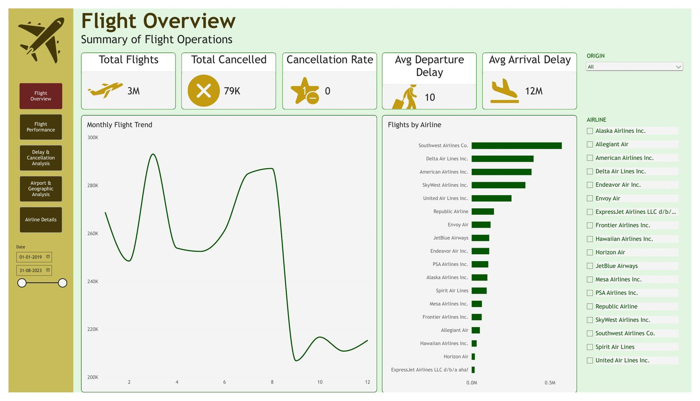
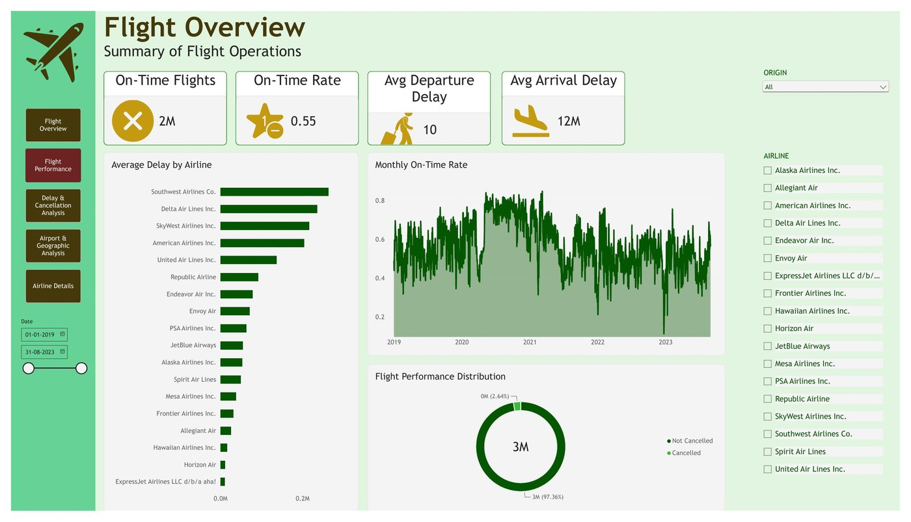
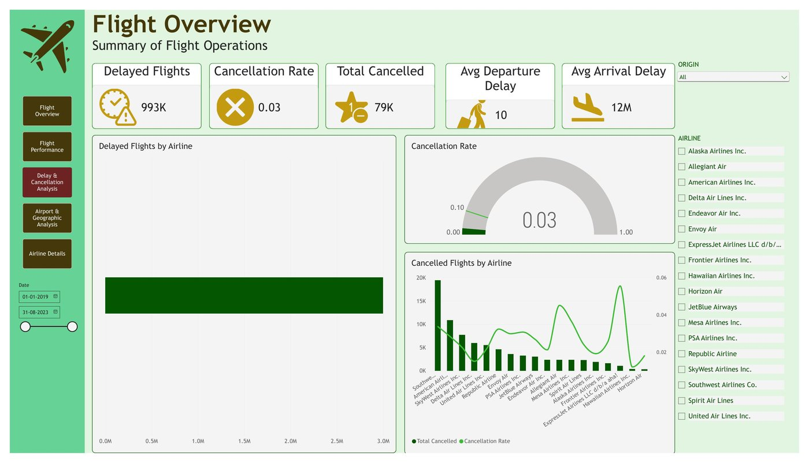
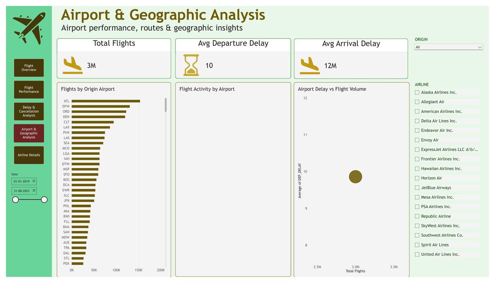
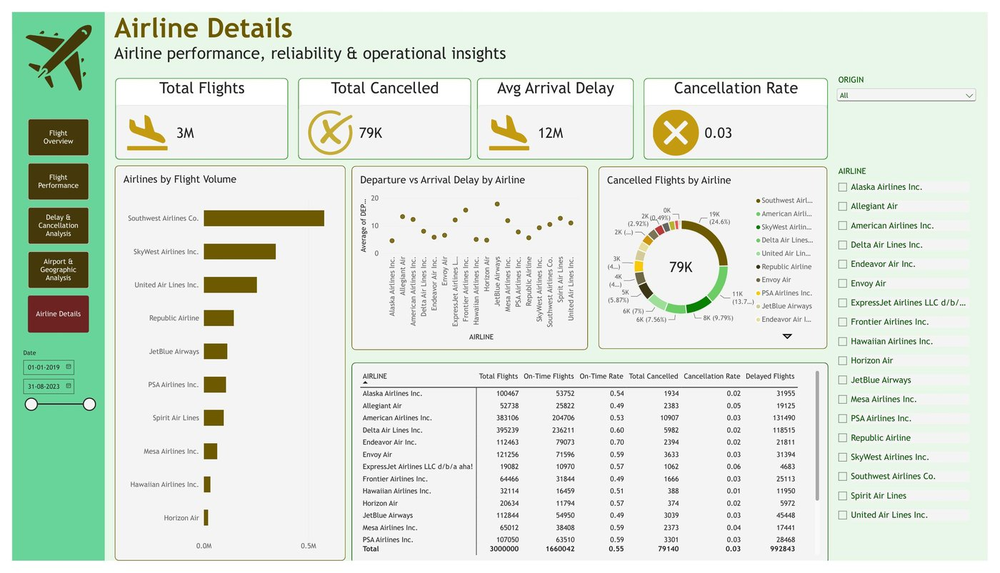

# Flight Operations Dashboard

A 5-page Power BI dashboard analyzing US domestic flight operations — covering volume, delays, cancellations, and airline/airport performance — for the period **Jan 2019 to Aug 2023**.

## Overview

This project explores a flights dataset (~3M records) to answer key operational questions: How many flights are delayed or cancelled? Which airlines and airports perform best? How has on-time performance trended over time?

## Key Metrics

- **Total Flights:** 3,000,000
- **On-Time Flights:** 1,660,042 (On-Time Rate: 0.55)
- **Delayed Flights:** 992,843
- **Total Cancelled:** 79,140 (Cancellation Rate: 0.03)
- **Average Departure Delay:** 10 minutes
- **Average Arrival Delay:** 12 minutes

## Dashboard Pages

### 1. Flight Overview
High-level KPIs — total flights, cancellations, cancellation rate, average departure/arrival delay — plus a monthly flight trend and flights-by-airline breakdown.



### 2. Flight Performance
On-time flights, on-time rate, average delay by airline, monthly on-time rate trend, and a flight performance distribution (cancelled vs. not cancelled).



### 3. Delay & Cancellation Analysis
Delayed flight counts, cancellation rate gauge, delayed flights by airline, and cancelled flights by airline (count + rate).



### 4. Airport & Geographic Analysis
Flights by origin airport, flight activity by airport, and airport delay vs. flight volume scatter plot.



### 5. Airline Details
Airlines by flight volume, departure vs. arrival delay by airline, cancelled flights by airline, and a full airline-level summary table.



## Filters & Interactivity

- **Date range slicer** (01-01-2019 to 31-08-2023)
- **Origin airport filter**
- **Airline filter** (18 major US carriers, e.g., Southwest, Delta, American, United, JetBlue, SkyWest, Alaska, Spirit, Frontier, Hawaiian)

## Tools Used

- Power BI Desktop
- Power Query (data transformation)
- DAX (measures and calculated columns)

## Files

```
├── flights.pbix          # Power BI Desktop file
├── flights.pdf           # Exported PDF snapshot of all dashboard pages
├── screenshots/          # Page-by-page screenshots
└── README.md
```

## How to View

1. Download `flights.pbix`
2. Open in Power BI Desktop
3. Use the slicers on the right to filter by date, origin, or airline

## Author

Maitrak
