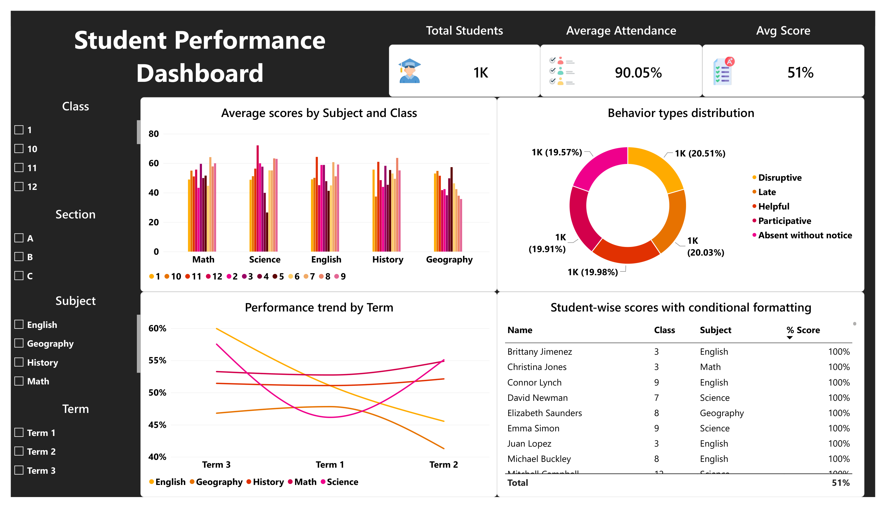
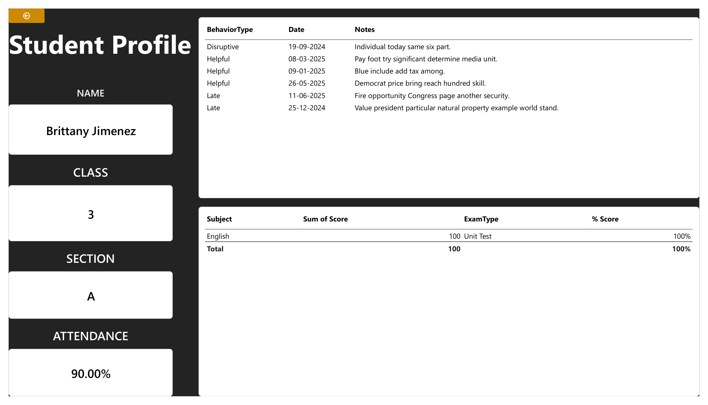
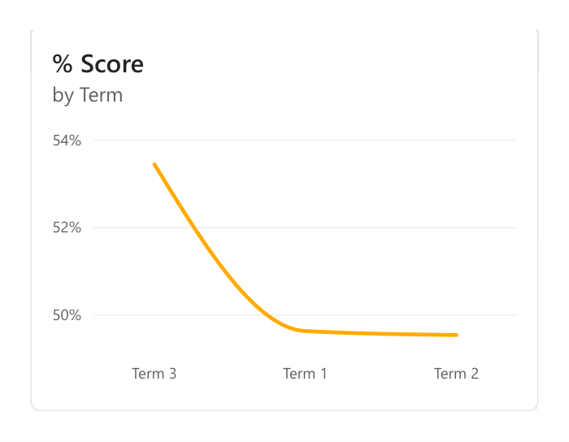

# Student Performance Dashboard — Power BI Practical Exam

**Course:** Data Analysis & Data Science — Red & White Skill Education
**Deliverable type:** Power BI `.pbix` file
**Total Marks:** 50

## Objective

An interactive Power BI dashboard analyzing student academic performance, attendance, and behavior across grades, subjects, and terms. Built to demonstrate data modeling, DAX, visualization, and storytelling skills.

## Dataset

| File | Fields |
|---|---|
| `Students.csv` | StudentID, Name, Gender, Class, Section |
| `Scores.csv` | StudentID, Subject, ExamType, Score, MaxScore, Term |
| `Attendance.csv` | StudentID, Date, Status (Present/Absent), Reason |
| `Behavior.csv` | StudentID, Date, BehaviorType, Notes |

- **Students:** 1,000 rows
- **Scores:** 30,000 rows
- **Attendance:** 100,000 rows
- **Behavior:** 6,500 rows

## Data Model

Star schema with `Students` as the central table, related 1-to-many to `Scores`, `Attendance`, and `Behavior` on `StudentID`.

```
              ┌────────────┐
              │  Students  │  (1)
              └─────┬──────┘
        ┌───────────┼───────────┐
       (*)          (*)         (*)
   ┌────────┐  ┌────────────┐  ┌──────────┐
   │ Scores │  │ Attendance │  │ Behavior │
   └────────┘  └────────────┘  └──────────┘
```

**Cleaning applied:**
- Correct data types set per column (`Score`/`MaxScore` as Whole Number, `Date` as Date, etc.)
- Trimmed/cleaned text fields
- Blank `Reason` values in Attendance (present for "Present" status) replaced with `"N/A"`

## DAX Measures

```dax
% Score = DIVIDE(SUM(Scores[Score]), SUM(Scores[MaxScore]))

Average Score per Subject = AVERAGE(Scores[Score])

Attendance % =
DIVIDE(
    CALCULATE(COUNTROWS(Attendance), Attendance[Status] = "Present"),
    COUNTROWS(Attendance)
)

Behavior Count per Type = COUNTROWS(Behavior)

Performance Category =
SWITCH(
    TRUE(),
    [% Score] >= 0.75, "High",
    [% Score] >= 0.40, "Medium",
    "Low"
)
```

## Report Pages

### 1. Academic Overview

KPI cards (Total Students, Average Attendance, Avg Score), a clustered bar chart of average scores by subject and class, a line chart of performance trend by term, a donut chart of behavior type distribution, and a student-wise score table with conditional formatting. Slicers for Class, Section, Subject, and Term filter the whole page.



### 2. Student Profile (Drillthrough)

Reached by right-clicking a student row on the Academic Overview table and selecting **Drillthrough → Student Profile**. Shows that student's name, class, section, attendance %, subject-wise scores, and behavior log.



### 3. Tooltip Page — % Score by Term

A compact report-page tooltip that appears on hover over the main charts, showing a mini trend line of % Score across terms.



## Interactivity

- **Slicers:** Class, Section, Subject, Term
- **Drillthrough:** Academic Overview table → Student Profile page, filtered by student
- **Tooltips:** Report-page tooltip with mini % Score trend line
- **Navigation:** Buttons to switch between Academic and Behavioral views

## Evaluation Criteria Summary

| Component | Marks |
|---|---|
| Data Modeling & Cleaning | 10 |
| DAX Calculations | 10 |
| Visualizations & Storytelling | 15 |
| Slicers, Filters & Drillthrough | 10 |
| Optional Features | 5 |
| **Total** | **50** |

## Deliverables

- `.pbix` file
- (Optional) short documentation of insights derived
- (Optional) mobile layout for Power BI mobile app
